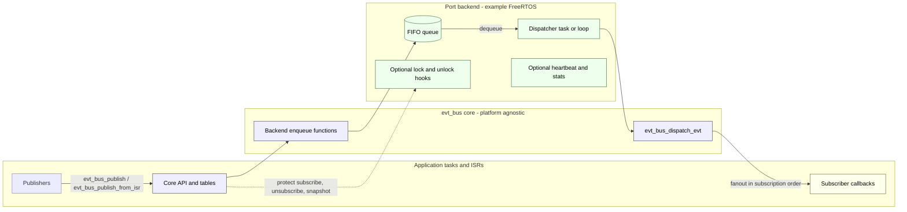

# evt_bus

Deterministic, zero-heap event bus for embedded systems.

**Publish = enqueue**, **single-context dispatch**, safe handle-based subscribe/unsubscribe, portable core + optional OS ports.

---

## Why `evt_bus`

`evt_bus` is a small publish/subscribe middleware intended for firmware and other resource-constrained systems where **determinism and bounded behavior matter more than throughput**.

It is designed to be:
- predictable under load
- easy to reason about in RTOS systems
- safe against stale-handle and lifecycle bugs
- portable across bare-metal and RTOS environments

This is **not** a message broker or async framework — it is a deterministic event fanout mechanism.

---

## Architecture (1-page)



Key takeaways:
- Publishers **never** execute callbacks (publish = enqueue only).
- All callbacks run in **one dispatcher context** (the port owns that context).
- Core stays RTOS-agnostic; ports provide queue/task/locking (and optional heartbeat).

---

## Key Guarantees

**What `evt_bus` guarantees:**
- **No heap usage** in core
- **Bounded runtime** for publish and dispatch
- **Publish never runs callbacks**
- **Single dispatcher execution context**
- **FIFO event ordering** (by enqueue order)
- **Subscriber callbacks invoked in subscription order**
- **Safe unsubscribe** via handle generation (no stale reuse bugs)
- **Fixed maximum payload size** (`EVT_INLINE_MAX`)
- **Drop-new policy** when the queue is full (publish returns `false`)

**What `evt_bus` does *not* guarantee:**
- Delivery under saturation
- Blocking or retry semantics for critical events
- Automatic offloading of slow callbacks
- Watchdog or recovery policy

Those are intentionally left to the application.

---

## When NOT to use `evt_bus`

Consider something else if you need:
- **Hard delivery guarantees / reliability protocols:** if you need “must deliver” semantics (blocking until accepted, retry with backoff, persistence, ACK/NAK, dedup), implement it above evt_bus or use a different mechanism (e.g., point-to-point queue/mailbox or a reliable message layer).
- **Large or variable-sized payloads** beyond `EVT_INLINE_MAX` (or you don’t want copy-in).
- **Multiple independent dispatch contexts** (e.g., per-module thread pools) rather than single-context fanout.
- **Complex routing / filtering / topic hierarchies** beyond simple `evt_id` fanout.
- **Unbounded subscriber counts** or highly dynamic subscription graphs (this is table-based and bounded by config).
- A system where callbacks must run **immediately in publisher context** (by design, they will not).

`evt_bus` is a good fit when you want a small, bounded, deterministic event fanout primitive and you’re okay handling policy (drops, criticality, recovery) at the application layer.

---

## Repository Structure

```
.
├── include/
│   └── evt_bus/
│       ├── evt_bus.h
│       ├── evt_bus_types.h
│       └── evt_bus_config.h
├── src/
│   └── evt_bus.c
├── ports/
│   ├── freertos/              # FreeRTOS backend + helpers
│   └── esp-idf/
│       └── evt_bus/           # ESP-IDF component wrapper
├── tests/
│   ├── test_evt_bus.c
│   ├── fake_evt_bus_backend.c
│   └── test_helpers.h
├── externals/
│   └── unity/                 # Unity test framework (submodule)
├── docs/
│   └── DESIGN.md
├── CMakeLists.txt
└── Makefile
```

---

## Quickstart

### Build (library)

```sh
make
```

This builds the core library using CMake.

> The default build is intended for consumers of the library.

---

## Basic Usage

### Initialize

```c
#include "evt_bus/evt_bus.h"

void app_init(void)
{
    evt_bus_init();
}
```

### Subscribe and Publish

```c
static void on_my_event(const evt_t *evt, void *ctx)
{
    (void)ctx;
    /* evt->payload is valid only during this callback */
}

void app_setup(void)
{
    evt_sub_handle_t h =
        evt_bus_subscribe(MY_EVT_ID, on_my_event, NULL);
    (void)h;
}

void app_do_something(void)
{
    const uint32_t x = 123;
    bool ok = evt_bus_publish(MY_EVT_ID, &x, sizeof(x));
    /* ok == false means the event was dropped */
}
```

---

## Payload Model

- Payloads are **copied at publish time** into a fixed-size inline buffer.
- **Maximum payload size:** `EVT_INLINE_MAX`
- If `payload_len > EVT_INLINE_MAX`, publish returns `false`.
- Payload memory passed to callbacks is **only valid during callback execution**.

If a callback offloads work to another task, it must copy the payload.

---

## Drop Policy & Instrumentation

`evt_bus` uses a **drop-new** policy when the queue is full.

- `evt_bus_publish()` returns `false` if the event was not enqueued.
- Applications are expected to:
  - count dropped events
  - classify which events are critical vs lossy
  - apply recovery or degradation policy externally

No drop handling policy is enforced by the core or ports.

---

## Dispatching Events

`evt_bus` does **not** create threads by itself.

You must dispatch events from **one dedicated execution context**.

### Bare-metal / polling
- Dequeue events from your backend
- Call `evt_bus_dispatch_evt(&evt)`

### RTOS
- Create a dispatcher task
- Block on the queue
- Call `evt_bus_dispatch_evt()` for each dequeued event

Callbacks always run in the dispatcher context.

---

## Thread-Safety Model

- The core supports concurrent publish / subscribe / unsubscribe.
- **Thread-safety is provided by the selected port** via optional `lock/unlock` hooks.
- If no lock is provided, the application must serialize calls externally.

The core does not assume an RTOS, but will use locks if supplied.

---

## OS Ports

The project is split into:
- **Core** — portable, RTOS-agnostic logic
- **Ports** — optional OS-specific backends

A port typically provides:
- bounded FIFO queue
- blocking dequeue
- dispatcher task wrapper (optional)
- ISR-safe publish helper (optional)
- lock / critical-section mapping (optional)
- observability hooks (optional)

### FreeRTOS

`ports/freertos/` provides a backend using FreeRTOS queues and an optional dispatcher task.

This repository does **not** vendor FreeRTOS.

Your application must already provide:
- `FreeRTOS.h`
- `FreeRTOSConfig.h`
- the selected portable layer headers

The repository validates:
- core behavior via Unity tests
- FreeRTOS port compile-checks using stub headers

---

### ESP-IDF

A ready-to-use ESP-IDF component wrapper is provided at:

```
ports/esp-idf/evt_bus
```

Add it via `EXTRA_COMPONENT_DIRS`:

```cmake
set(EXTRA_COMPONENT_DIRS
    "${CMAKE_CURRENT_LIST_DIR}/path/to/evt_bus/ports/esp-idf"
)
```

Then include normally:

```c
#include "evt_bus/evt_bus.h"
```

FreeRTOS port options (queue depth, heartbeat, observability, etc.)
are exposed via Kconfig when the component is enabled.

---

## Running Tests (Library Development)

> This section is for contributors working on the core library.

```sh
git submodule update --init --recursive
make test
```

This runs Unity unit and integration tests covering:
- subscribe / unsubscribe
- publish / dispatch semantics
- stale handle safety
- self-healing subscription lists

---

## Documentation

- `docs/DESIGN.md` — detailed architecture, semantics, and contracts

---

## License

MIT